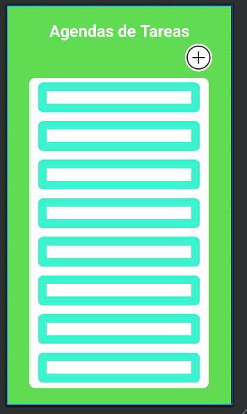
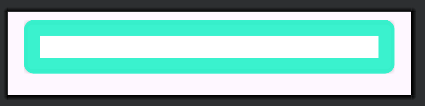
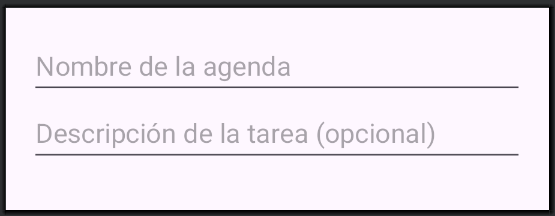
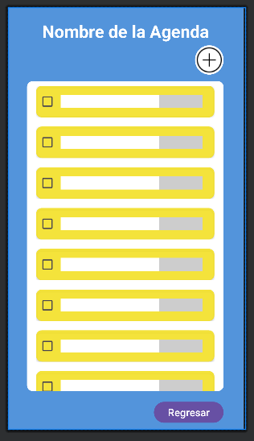
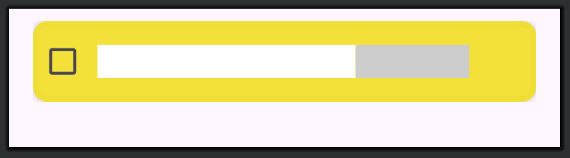
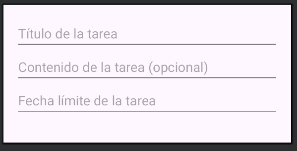

# AgendaDeTareas
Aplicación Android para crear agendas donde se crearán tareas, que se podrán consultar, modificar y eliminar

---

## Capturas de Pantalla








---

## Características

- Arquitectura MVC
- Almacenamiento local con SharedPreferences
- Diseño Material Design
- Navegación entre vistas: Intent

---

## Requisitos

- Android Studio Giraffe (o superior)
- JDK 17
- Gradle 8.2.1
- Dispositivo/emulador con Android 6.0 (API 23) o superior

---

## Instalación

Sigue estos pasos para correr el proyecto en tu entorno local:

1. Clona el repositorio
   ```bash
   git clone https://github.com/LucasBermudoJunco/AgendaDeTareas.git

2. Abre el proyecto en Android Studio

3. Espera a que se sincronice Gradle (puede tardar un rato la primera vez)

4. Configura un dispositivo/emulador (API 23 o superior)

5. Ejecuta el proyecto haciendo click en el botón Run (el triángulo verde)

## Tecnologías y Herramientas Usadas

- Lenguaje: Kotlin
- Arquitectura: MVC
- Persistencia Local: SharedPreferences con Gson
- UI: Material Components, ConstraintLayout, RecyclerView
- Navegación entre vistas: Intent

## Estructura del proyecto


## Contacto

Desarrollado por Lucas Bermudo Junco - lucasbjunco@gmail.com
GitHub: https://github.com/LucasBermudoJunco